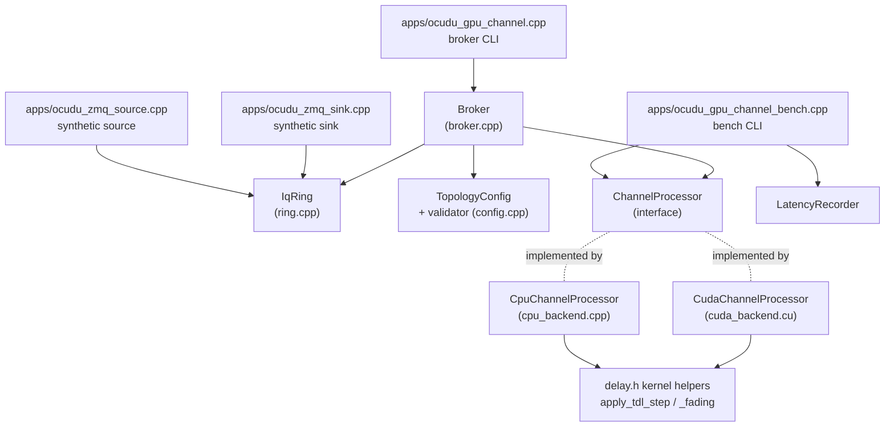
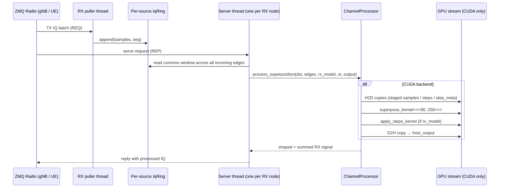

# ocudu-gpu-channel — Project Architecture Blueprint

> Generated 2026-05-23 by the [`architecture-blueprint-generator`](https://skills.sh/github/awesome-copilot/architecture-blueprint-generator) skill against commit `52b52f3`.
> This is an auto-derived companion to the hand-written technical reference at [`docs/index.html`](../index.html). It surfaces the architecture from code-structure evidence only; the existing doc is the human-curated narrative.

---

## 1. Detected stack and pattern

| Axis | Detected |
|---|---|
| Languages | C++20 (host), CUDA (device), Python 3 (scripts), Bash (scripts) |
| Build | CMake 3.20+ |
| Transport | libzmq (REQ/REP), per-source rings |
| GPU runtime | CUDA Toolkit 12.8 (RTX 5090, SM 12.0) |
| RNG | std::mt19937_64 (host) + cuRAND Philox 4_32_10 (device) |
| Test runner | CTest (test_config, test_processing, test_ring, test_broker) |
| Primary pattern | **Layered architecture with strategy-pattern backends** |
| Secondary patterns | Producer/consumer (rings), thread-per-node (server threads), per-link state isolation, single-shared-helper (delay.h) |

The repo is a single-process realtime broker. There is no microservice split, no DI container, no ORM, no HTTP, no Auth. Cross-cutting concerns are minimal because the surface area is "stand up a thread-pool, copy IQ in, run a GPU kernel per slot, copy out, send."

## 2. High-level layering

```
┌─────────────────────────────────────────────────────────────────────────┐
│  apps/  —  CLI entry points (no business logic)                          │
│     ocudu_gpu_channel.cpp        broker CLI                              │
│     ocudu_gpu_channel_bench.cpp  per-topology latency bench              │
│     ocudu_zmq_source.cpp         synthetic IQ source                     │
│     ocudu_zmq_sink.cpp           synthetic IQ sink                       │
└──────────────────────────────────┬───────────────────────────────────────┘
                                   │
┌──────────────────────────────────▼───────────────────────────────────────┐
│  src/broker.cpp  —  ZMQ orchestration + thread management                │
│     • One server thread per destination node (REP socket)                │
│     • One puller thread per source node (REQ socket → ring)              │
│     • Per-slot serve: align → read → process_superposition → send        │
│     • Strict-realtime gate counters: rx_starvations / tx_queue_overflows │
│                                     / tx_sequence_gaps / zmq_errors      │
└──────────────────────────────────┬───────────────────────────────────────┘
                                   │ ChannelProcessor::process_superposition()
┌──────────────────────────────────▼───────────────────────────────────────┐
│  ChannelProcessor (interface in include/ocudu_gpu_channel/processing.h)  │
│  ┌────────────────────────┐    ┌─────────────────────────────────────┐   │
│  │ CpuChannelProcessor    │    │ CudaChannelProcessor                │   │
│  │ src/cpu_backend.cpp    │    │ src/cuda_backend.cu                 │   │
│  │ — reference, bit-exact │    │ — primary target, RTX 5090          │   │
│  └────────────┬───────────┘    └──────────────┬──────────────────────┘   │
│               │                               │                          │
│               └───────────┬───────────────────┘                          │
└───────────────────────────┼──────────────────────────────────────────────┘
                            │  calls shared helpers
┌───────────────────────────▼──────────────────────────────────────────────┐
│  include/ocudu_gpu_channel/delay.h  —  single source of truth for kernel │
│     apply_tdl_step()          static multi-tap convolution               │
│     apply_tdl_step_fading()   + Jakes Doppler + Rician LOS               │
│     prepare_tdl_state()       per-link runtime state setup               │
│     prepare_tdl_fading_state() per-link sub-ray angle draws              │
│     compute_windowed_sinc_taps() 8-tap Hamming-windowed sinc             │
└──────────────────────────────────────────────────────────────────────────┘
```

Dependencies flow downward. There are no upward dependencies (the kernel helpers in `delay.h` know nothing about ZMQ, the broker knows nothing about CUDA syntax, etc).

## 3. Component map

| Component | Header | Implementation | Role |
|---|---|---|---|
| `IqSample` | `iq.h` | inline | The complex-float IQ primitive that flows through every layer |
| `IqRing` | `ring.h` | `ring.cpp` | Bounded per-source ring buffer, single-writer multi-reader, sequence-numbered |
| `Broker` | `broker.h` | `broker.cpp` | ZMQ orchestrator, thread spawner, strict-realtime gate |
| `ChannelProcessor` | `processing.h` | `processing.cpp` | Abstract strategy — both backends implement this |
| `CpuChannelProcessor` | `cpu_backend.h` | `cpu_backend.cpp` | Reference backend; per-link `LinkState` with scratch buffers |
| `CudaChannelProcessor` | `cuda_backend.h` | `cuda_backend.cu` | Primary target; per-node `CudaSuperposeState` + per-link `CudaLinkSlot { LinkModelState }`; fused `superpose_kernel` |
| `TopologyConfig` + parsers | `config.h` | `config.cpp` | YAML topology loader + strict validator (numbers / sample-rate / tap counts / LOS K-factor) |
| `LatencyRecorder` | `latency.h` | `latency.cpp` | p50/p95/p99/max gates for the bench |
| `delay.h` kernel helpers | `delay.h` | inline header | The shared kernel math both backends call |
| `apps/*` | — | one .cpp per app | Thin CLI wrappers; no logic |

## 4. Architectural visualization

### 4.1 Component dependency (Mermaid)



### 4.2 Per-slot data flow (C4-Level-2 sequence)



## 5. Cross-cutting concerns

| Concern | Where it lives | Status |
|---|---|---|
| **Strict realtime** | `broker.cpp` — per-puller / per-server counters; CLI `--strict-realtime` makes nonzero a hard failure | Production |
| **Determinism / bit-exactness** | `delay.h` is the shared helper both backends call; CUDA fading parity test asserts bit-exact CPU↔CUDA | Production |
| **Validation** | `config.cpp::validate_config` — strict numeric parsing, sample-rate match, tap-count / LOS K-factor gates | Production |
| **Logging** | `event=` lines on stdout from broker (`event=stop`, `event=heartbeat`, `event=gpu_timings`, `event=cpu_stage_timings`) | Production |
| **Error handling** | Throw-and-die: data-integrity failures abort the run; transient ZMQ retries handled at the puller layer | Production |
| **Authentication** | None — broker assumes a trusted single-host LAN. By design (the `docs/distributed.md` note rules out untrusted networks). | Out of scope |
| **Configuration management** | YAML topology files in `examples/`, parsed at start. No runtime mutation today (planned: §19 "operational flexibility") | Static |

## 6. Extension points

| Extension | Mechanism | Recent example |
|---|---|---|
| Add a chain step type | `ModelStepType` enum + `apply_step()` switch in both backends + parser keys in `config.cpp` + validator gate | The `tdl` step replaced three legacy steps (Phase 1.3) |
| Add a fading spectrum | `FadingSpectrum` enum + branch in `apply_tdl_step_fading` | Jakes is implemented; Gaussian / Flat are reserved enum values that throw at kernel entry |
| Add a backend | Implement `ChannelProcessor`, register in `create_channel_processor()` (`processing.cpp`) | CPU and CUDA today |
| Add a topology shape | Pure YAML — no code change. Validator enforces sanity (validator-rejects-non-sources etc) | Phase 1.5 added `topology.tdl-{a,b,c,d,e}.cuda.yaml` |
| Add a metric / counter | `Broker::stats()` struct + an `event=` log line + gate check in `--strict-realtime` | Phase B2.2 added `room_stall` |
| Add a perf measurement | New entry in `scripts/remote/perf-fanin-sweep.sh CONFIGS[]` + (optional) static YAML in `examples/` | Phase 1.5 added `static-tdl-a` mode |

## 7. Testing architecture

| Test | Scope | What it asserts |
|---|---|---|
| `test_config` | YAML parser + validator | Round-trip; rejection of malformed configs; LOS K-factor gate; tap-count bounds |
| `test_ring` | `IqRing` | Bounded overflow behavior; multi-reader cursor independence |
| `test_processing` | Both backends | TDL static (identity / legacy parity / 3-tap impulse / sinusoid passband); TDL fading (stationary / determinism / strong LOS / Bessel J₀ autocorrelation); CPU↔CUDA bit-exact (CUDA-gated) for all of the above |
| `test_broker` | End-to-end ZMQ loopback | Bidirectional IQ flow; strict-realtime counter cleanliness; multi-UE lockstep scenario |
| `scripts/remote/gpu-test-sequence.sh` | RTX 5090 hardware-in-loop | 7-step sequence: CUDA build → ctest → clean relay → AWGN relay → 3-node graph → 2-cell multi-gNB → TDL-A profile |
| `scripts/remote/ocudu-attach-smoke.sh` | Real OCUDU gNB + srsUE attach | RRC connected + PDU established + ping ok |

## 8. Things this blueprint surfaces that Diagram F (§3) does not

Diagram F (in [`docs/index.html`](../index.html#L369)) shows three layers: **ZMQ I/O → channel processing → ZMQ I/O**, one direction per slot. It's tight, narrative-tuned, and intentionally hides everything below the broker boundary. This blueprint, by contrast:

1. **Names the thread-pool shape explicitly** — Diagram F shows "channel processing" as one box; this blueprint surfaces "one server thread per destination node + one puller thread per source node" because the codebase makes that the central concurrency invariant.
2. **Names the strategy boundary** — `ChannelProcessor` interface with two implementations is invisible in Diagram F (it shows just "channel processing"). The strategy boundary is what makes CPU↔CUDA bit-exact testing possible.
3. **Names `delay.h` as the single-source-of-truth kernel layer** — Diagram F doesn't show this because it's a code-organization fact, not an architectural layer per se. But it's the load-bearing constraint of the whole project (one helper, two backends, one truth).
4. **Component dependency graph** — Mermaid in §4.1 above shows the explicit code-level dependencies; Diagram F is the conceptual data flow.
5. **Cross-cutting concerns table** — Diagram F doesn't claim to cover this; the table here names which file owns each concern.

## 9. Things Diagram F surfaces that this blueprint does not

1. **One direction per slot** — Diagram F's most important framing claim. This blueprint shows the strategy boundary but doesn't emphasize the slot-cadence asymmetry the way the hand-written §3 prose does.
2. **The visual emphasis** — Diagram F uses color-coded tiers (ZMQ tier vs processing tier vs ZMQ tier) to make the layers immediately readable. Mermaid graphs are harder to scan at the same speed.
3. **Narrative tuning** — Diagram F is sized and laid out for the doc's reader; this blueprint is exhaustive in a way that interrupts a first read.

## 10. Recommendation

Keep both. Diagram F stays as the primary §3 figure — it's tighter, color-coded, and matches the doc's reader voice. This blueprint sits under `docs/blueprint-generated/` as a code-evidence companion useful for new contributors who want a deeper component map and dependency graph than the narrative reference provides. Regenerate this blueprint when the layer structure changes (most recently: Phase 1.3 tdl consolidation, Phase 1.4 fading kernel addition, Phase B1 process_superposition unification).
