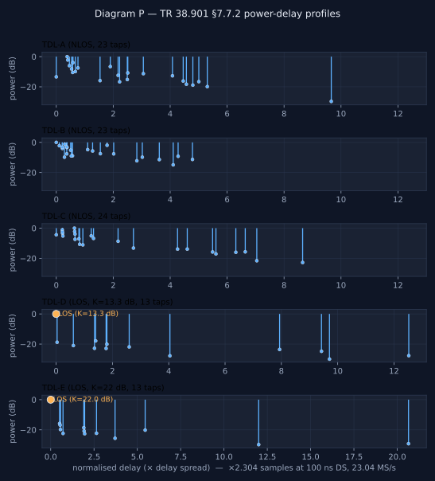
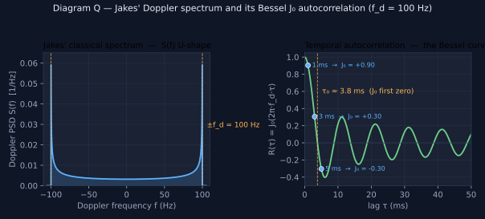
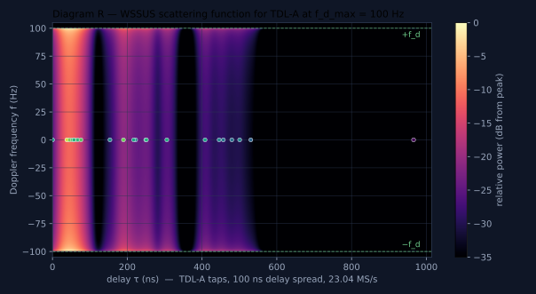

# Channel models

(section-6)=

(physics)=

## Channel physics — Jakes, Rician, TDL profiles

Before the device kernel section that runs the math ([The channel — applied per edge (device kernel by default, host fallback)](../reference/device-pipeline.md#kernels)), this section is the math itself: what a tap is, how the Doppler spectrum shapes a time-varying tap, why Rayleigh and Rician envelopes are not configuration knobs but consequences, and how the TR 38.901 §7.7.2 TDL profiles map onto the YAML schema. All implementation details follow the same wireless-modelling textbook (Bello / Jakes / Zheng & Xiao); the math here is the numerical reference used by both backends.

**Scope is TDL, not full CDL.** The Clustered Delay Line (CDL) models in TR 38.901 §7.7.1 add per-cluster angles, polarisation, sub-ray geometry, and antenna array response on top of the basic tap structure. Those layers need beamforming machinery the broker does not have today; CDL stays out of scope. The 23-tap profile counts and example references below are TDL-A / TDL-B / TDL-C tables (TR 38.901 §7.7.2), not their CDL siblings.

### Static taps — what tdl does

A single chain step on a single edge holds an array of `(delay, complex_gain)` taps. The kernel sums `y[idx] = Σ a`<sub>`k`</sub>` · x[idx − τ`<sub>`k`</sub>`]` in registers using one shared staged buffer plus a small `delay_line` ring for cross-slot history.

**Fractional delays from day one.** Tap delays are `double` samples; sub-sample offsets resolve via the shared `compute_windowed_sinc_taps` helper in `delay.h` (8-tap Hamming-windowed sinc, DC-normalised) — the same coefficient generator both backends call out of `apply_tdl_step`. This avoids snapping CDL delays to the nearest integer sample (which would lose up to ~22 ns of delay-spread fidelity at 23.04 MS/s).

**What it buys.** Static frequency-selective channels — 3GPP TDL profiles (TR 38.901 §7.7.2 tables 7.7.2-1 through 7.7.2-5), 2-ray ground-reflection, indoor multipath. Memory cost is roughly the same as a single-tap edge today and **~24× lower** than the naive "one parallel edge per tap" approach for a 23-tap TDL-A profile, because the cross-slot history is one ring per edge rather than one per tap.



Diagram P — power-delay profiles (PDP) for the five TR 38.901 §7.7.2 TDL profiles, plotted on the published normalised-delay axis. **NLOS profiles** (TDL-A, B, C) carry only Rayleigh-Jakes taps; **LOS profiles** (TDL-D, E) have an orange-highlighted first tap whose `los_k_db` sets the Rician K-factor (13.3 dB for TDL-D, 22 dB for TDL-E). Scaling to samples at the project's 23.04 MS/s reference rate and 100 ns delay spread multiplies the x-axis by 2.304. Regenerated from the same Sionna JSON the project's example YAMLs use; produced by `scripts/figures/regen_fading_figures.py`.

### Time-varying tap gain — the fading sub-config (Phase 1.4, landed)

The `fading` sub-config shipped in Phase 1.4 (commits `61d76bb` for the schema / parser / validator and `e48e95c` for the Jakes kernel + LOS Rician composition). The description below tracks what the running code does today; planned extensions (the Gaussian and Flat spectra reserved in the enum) are flagged where they would slot in.

**The model.** When the step's `fading` sub-config is enabled, each diffuse tap’s complex gain `a`<sub>`k`</sub>`(t)` approximates a zero-mean complex **stationary Gaussian process** using a finite sum of sinusoids. The single knob that defines the shape is the tap's **Doppler power spectrum** `S`<sub>`k`</sub>`(f)` — equivalently, the temporal autocorrelation `R`<sub>`k`</sub>`(Δt)`, since one is the Fourier transform of the other (the WSSUS framework, Bello 1963). Everything else about the tap follows from that single choice.

**Default spectrum: Jakes' classical (per edge, not per tap).** Cosine-symmetric around 0 Hz, parameterised by a **single per-edge** max-Doppler frequency `f`<sub>`d,max`</sub>` = v · f`<sub>`c`</sub>` / c` set by the UE velocity — stationary radio mismatch ≈ 0 Hz, pedestrian at 3.5 GHz ≈ 11 Hz, car ≈ 350 Hz. **All taps share the same `f`<sub>`d,max`</sub>; the per-tap variation comes from each tap's own random sub-ray angle draws, not from different velocities per tap.** Other spectra (Gaussian, flat) drop in as alternate generators behind the same sub-config; the cluster-specific spectra of full CDL are out of scope here as noted above.

**Envelope statistics fall out — they are not a separate knob.** A zero-mean complex Gaussian process has a **Rayleigh** envelope by construction; there is nothing to configure. A **Rician** envelope is the same Gaussian process *plus* a deterministic LOS path (its own gain, delay, and Doppler shift), and the K-factor is just the LOS-to-scattered power ratio. So "Rayleigh vs. Rician" is a topology question (is there a deterministic LOS tap alongside the faded ones?), not a fading parameter.

**Per-tap variation comes from sub-ray angles, not from different velocities.** The per-edge `f`<sub>`d,max`</sub> is the bound; each tap independently draws `M ≈ 20` random sub-ray angles `α`<sub>`k,m`</sub> uniform in `[0, 2π)`, and the tap's instantaneous contribution at time `t` is the sum-of-sinusoids `a`<sub>`k`</sub>`(t) ∝ Σ`<sub>`m`</sub>` exp(j(2π · f`<sub>`d,max`</sub>` · cos(α`<sub>`k,m`</sub>`) · t + φ`<sub>`k,m`</sub>`))`. The Jakes spectrum emerges from the cos(α) projection of a common `f`<sub>`d,max`</sub> over many sub-rays — exactly what Sionna's TR 38.901 TDL implementation does (`tr38901/tdl.py`) and what Zheng & Xiao (2003) derive as the WSS-correct improved Jakes generator. The LOS variant (TDL-D / TDL-E) adds a deterministic specular component to the first tap with Doppler shift `f`<sub>`d,max`</sub>` · cos(α`<sub>`LOS`</sub>`)` — also derived from the same per-edge `f`<sub>`d,max`</sub>, not an independent per-tap value.

**Implementation.** The implementation uses `M = 20` sinusoids per tap. `prepare_tdl_fading_state` in `include/ocudu_gpu_channel/delay.h` draws the `M` angles `α`<sub>`k,m`</sub> and the `M` initial phases `φ`<sub>`k,m`</sub> from `std::mt19937_64` using the shared physical-link/lane seed functions described below. Both backends use the same seed derivation and draw order; the coherent LOS coefficient is specified separately by `los_matrix`. To bound kernel cost, the generator produces `g`<sub>`k`</sub>`(t)` on a coarse grid (default `grid_us = 100` — 10 kHz, ~28× oversampling vs. a 350 Hz Jakes spectrum) with **phase accumulation** (one complex multiply per sub-ray per grid step, not a sin/cos pair), then linearly interpolates up to per-sample resolution. Interpolation accuracy depends on Doppler and grid spacing; retain the tested values when reproducing a result. LOS taps add a deterministic specular component with its own per-sample phase accumulator (also no per-sample trig), composed via the Rician `[√(K/(K+1)), √(1/(K+1))]` factor split. Gaussian and Flat spectra are reserved in the `FadingSpectrum` enum (so YAMLs can already declare them) but their generator math is not implemented; the kernel throws on encountering them — a later-phase drop-in.



Diagram Q — Jakes' classical Doppler spectrum and its temporal autocorrelation. **Left:** the U-shaped PSD `S(f) = 1 / (π·f`<sub>`d`</sub>`·√(1 − (f / f`<sub>`d`</sub>`)²))` on `|f| < f`<sub>`d`</sub>; the energy is concentrated at the band edges — broadside scatterers (the bulk of the ring under uniform-AoA) contribute near-zero Doppler shift, while forward and backward scatterers contribute ±f<sub>d</sub>. **Right:** the time autocorrelation `R(τ) = J`<sub>`0`</sub>`(2π·f`<sub>`d`</sub>`·τ)`; the marked blue points at τ ∈ {1, 3, 5} ms are exactly the lags the Bessel J<sub>0</sub> statistical test asserts (test (d) in `tests/core/test_processing.cpp`). f<sub>d</sub> = 100 Hz matches the illustrated test case; the schema default is zero.



Diagram R — the **WSSUS scattering function** for TDL-A at f<sub>d_max</sub> = 100 Hz on the (delay τ, Doppler f) plane. Each tap occupies a horizontal slice at its own delay, shaped along the Doppler axis by Jakes' U; the bulk of the energy hugs the green ±f<sub>d</sub> envelope. This is the figure that unifies the two prior diagrams: **frequency selectivity** shows up as multiple tap rows along the delay axis (Diagram P's vertical stems become rows here), and **time variation** shows up as the Doppler spread of each row (Diagram Q's U-shape becomes the column profile). A static channel collapses to vertical stripes at f = 0; a time-flat channel collapses to one row at τ = 0; TDL-A sits in the doubly-spread quadrant. Generated from the same TDL-A tap data the example YAML carries.

### TDL profile YAMLs (Phase 1.5, landed)

The five canonical 3GPP TR 38.901 §7.7.2 profiles (**TDL-A** through **TDL-E**) ship as ready-to-run example topologies in `use_cases/configs/topologies/channel_models/topology.tdl-{a,b,c,d,e}.cuda.yaml`. Each YAML is a bidirectional gNB↔UE pair with the profile applied to both edges.

**Translation rule.** The published normalised delays are scaled to samples at the project's 23.04 MS/s reference rate and a 100 ns desired delay spread: `delay_samples = normalised · 100 ns · 23.04 MS/s = normalised · 2.304`. Tap powers are carried verbatim. The Doppler default is `f`<sub>`d,max`</sub>` = 100 Hz` (≈30 km/h at 3.5 GHz, vehicular) with the Jakes spectrum.

**LOS profiles (TDL-D, TDL-E).** TR 38.901 publishes two zero-delay entries on the first cluster — the LOS specular and the co-located Rayleigh component — whose dB ratio is the cluster's Rician K-factor. The kernel composes both inside one tap via `g(t) = √(K/(K+1))·specular + √(1/(K+1))·rayleigh`, so the YAML carries a single tap with `is_los: true`, `los_k_db` set to the published ratio (13.3 dB for TDL-D, 22 dB for TDL-E), and `los_angle_rad: 0` (LOS co-axial with motion, maximum positive Doppler). TDL-E additionally combines two co-delay scatterer clusters at normalised 0.5440 — TR 38.901 separates them for spatial modelling, but the TDL form has no per-tap angles, so their linear powers are summed into one tap (−16.86 dB combined).

**Perf measurement.** `scripts/remote/perf-fanin-sweep.sh` picks up two CDL-shaped configs at the end of its existing one-to-N / M-to-N grid: a 1-edge TDL-A baseline (the demo YAML above) and an 8-UE fan-in TDL-A (`use_cases/configs/topologies/perf/topology.perf-tdl-a-fanin-8.cuda.yaml` — 1 gNB + 8 UEs, TDL-A on all 16 edges). The pair shows how the multi-tap convolution + Jakes generator scales with fan-in under realistic multipath, instead of only the single-tap `cuda_mvp` path.

Source of the published numbers: Sionna (`references/code/sionna/src/sionna/phy/channel/tr38901/models/TDL-{A..E}.json`, Apache-2.0), which itself transcribes TR 38.901 Tables 7.7.2-1 through 7.7.2-5.

### What this replaced (Phase 1.3, landed)

`tdl` shipped in Phase 1.3 (commits `9afb2de` → `aa006a9` on `main`) and subsumed three earlier single-tap chain steps that no longer exist in the schema:

- `gain` → a one-tap `tdl` with `delay_samples = 0` and the chosen complex gain.
- `integer_delay` → a one-tap `tdl` with the integer delay and unit gain.
- `fractional_delay` → a one-tap `tdl` with the fractional delay and unit gain.

All example YAMLs, all tests, and the perf-sweep scripts were migrated to the `tdl` shape in the same Phase 1.3 sequence. The per-edge delay knobs (`device.tx_timing_offset_samples`, `link.propagation_delay_samples`) kept their semantics but now fold into the chain-leading `tdl` step ([Signal alignment and time discipline](timing.md#alignment) describes the composition rules). The `path_loss`, `phase`, `cfo`, and `awgn` steps were unchanged — they remain as separate per- sample steps because they are not multipath operations.

**Doppler in current code.** Two complementary paths now ship: a deterministic Doppler shift (no spread) via the existing `cfo` chain step — set `cfo_hz` to `f`<sub>`d`</sub>` = v · f`<sub>`c`</sub>` / c` for a link-wide constant offset; and a *stochastic* Doppler spread via the `tdl` step's `fading:` sub-config (Phase 1.4) — the per-tap Jakes-shaped spectrum that emerges from sub-ray angles within each cluster, all bounded by the same per-edge `f`<sub>`d,max`</sub>, plus optional per-tap Rician LOS specular for TDL-D / TDL-E-style profiles.

(section-24)=

(mimo-matrix)=

## The matrix channel — fixed, correlated, and coherent LOS

Three ways to say what `H` is, in increasing order of physical content. All three expand to lanes and run on the per-edge kernel of [The channel — applied per edge (device kernel by default, host fallback)](../reference/device-pipeline.md#kernels) without a MIMO-specific code path.

### fixed_mimo — a deterministic matrix

A dense complex matrix, declared coefficient by coefficient, folded at load time into each lane's leading tap gain and phase. A tap already carries `a·e`<sup>`jφ`</sup>, so this needs no runtime field and no backend change. Two consequences are worth knowing before writing one:

- A unit coefficient adds exactly 0 dB and 0 rad, so identity and permutation matrices are **bit-exact**.
- A coefficient that is **absent is zero, and is not generated at all**. Decibels cannot express an exact zero, so a zero lane is dropped rather than attenuated — which is both exactly zero and cheaper. Sparse means what it reads as: an omitted lane is 0, not 1, and there is no implicit `1/√Nt` normalisation anywhere.

The following model fragment uses the parser's block-style syntax. Attach it to a topology with two transmit and two receive ports:

```yaml
models:
  dl_2x2:
    fixed_mimo:
      coefficients:
        - tap: 0
          rx: 0
          tx: 0
          real: 0.80
          imag: 0.10
        - tap: 0
          rx: 0
          tx: 1
          real: 0.25
          imag: -0.15
        - tap: 0
          rx: 1
          tx: 0
          real: -0.20
          imag: 0.30
        - tap: 0
          rx: 1
          tx: 1
          real: 0.90
          imag: -0.05
    chain:
      - type: tdl
        taps:
          - delay_samples: 0.0
            gain_db: 0.0
            phase_rad: 0.0
```

### Stochastic lanes — independent realizations of one channel

With a fading `tdl` chain and no matrix declared, each lane is an independent realization: the lanes of one physical link are `Nt×Nr` independent draws of the same channel. Two ownership rules make that reproducible and physically coherent:

- **Seed derivation is explicit.** `physical_link_seed` hashes the physical-link identity with FNV-1a and a fixed integer mix; `lane_fading_seed(link_seed, r, t, step)` then mixes the lane indices and step. Internal lane-key formatting does not affect this derivation, but changing the physical-link identity can change the realization. Both functions are defined in [config.cpp](../../src/config.cpp), independently of `std::hash`.
- **Absolute time belongs to the physical link, not the lane.** A lane cannot hold a clock — the field was deleted from the fading state and the fading routine takes time as an argument instead of advancing it. All `Nt×Nr` lanes of a link therefore share one time origin by construction, which is the second half of "one channel realization".

### spatial_correlation and los_matrix

Independent lanes are the `iid` case. A Kronecker declaration `E[h h`<sup>`H`</sup>`] = R`<sub>`rx`</sub>` ⊗ R`<sub>`tx`</sub> mixes the lanes' generators through an LDL<sup>H</sup> factor computed once at load, and the same routine decides positive semidefiniteness and produces the factor — a matrix the loader would refuse cannot enter through the runtime path either. Only upper-triangle entries are accepted, which makes a non-Hermitian or non-unit-diagonal matrix unrepresentable rather than merely rejected.

The runnable correlated topology supplies the complete block declaration:

```{literalinclude} ../../use_cases/configs/topologies/channel_models/topology.mimo-2x2-correlated.cuda.yaml
:language: yaml
:start-at:     spatial_correlation:
:end-before:     chain:
```

`los_matrix:` supplies the Rician specular coefficients and their phase relationship across lanes, replacing independent random phases. Its all-ones default is rank-1; an explicit matrix describes the chosen coherent geometry. Undeclared means all-ones (rank-1, phase 0 everywhere); **declared means fully declared**, because a partially specified LOS matrix has no defensible completion. Note the deliberate asymmetry with `fixed_mimo`, where an absent entry means zero: the two knobs look alike and their missing-entry semantics are opposites, which is why they have not been merged.

**Rejections are part of the interface.** `fixed_mimo` alongside a non-iid correlation is refused (two declarations of the same thing); so is `kind: full` (deferred, and the parser says so by name), a correlated link above the 16-lane cap, and a non-IID correlation block on a chain that does not lead with a fading `tdl`. At runtime, tap-scope updates and profile swaps are refused on a `fixed_mimo` link, because that link's matrix *is* its tap weights.

(mimo-kernel)=

### On the GPU — rows are a grid axis

Lane expansion needed no new kernel. `apply_channel_kernel` was already per-edge parallel on `grid.y`, so four lanes of a 2×2 are four edges. Superposition gained the second dimension: `grid.y = Nr` with a `row_begin[]` index, so row `r` sums exactly the lanes in `[row_begin[r], row_begin[r+1])`. That interval is only well-formed because lanes are **stably sorted** by `(destination node, rx_port)` when the topology is resolved — and the same stability fixes floating-point summation order, which is what makes the CPU↔CUDA parity contract of [Processor backends — CPU and CUDA](../reference/backends.md#backends) hold on multi-port topologies. The receiver model is applied per row with its own state, so sibling rows never share a CFO phase accumulator or an AWGN counter.

**One resolver, three consumers.** The broker, the CPU backend and the CUDA backend all used to walk `config.links` and derive lanes independently. Three independent derivations of the same lane set will eventually disagree, and the disagreement is **silent** — the relay keeps emitting IQ, it just stops being the `y = Hx` the topology describes. The lane set, lane order and per-lane state keys are computed once by `resolve_topology()` and the three consumers read it.
