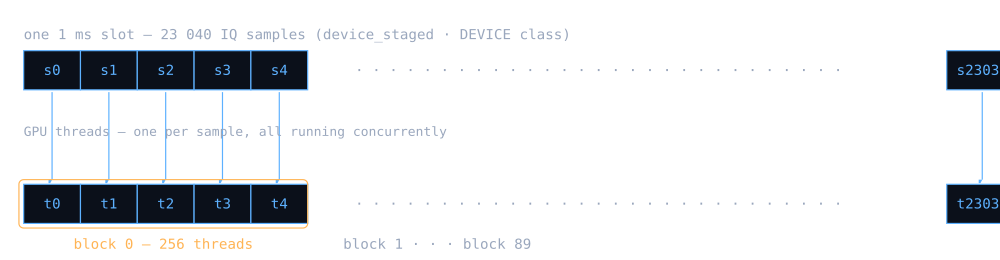
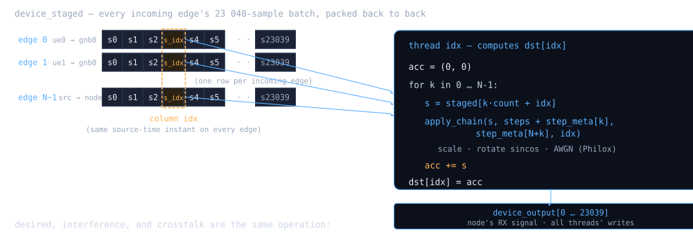

# CUDA device pipeline

(section-11)=

(kernels)=

## The channel — applied per edge (device kernel by default, host fallback)

The wireless channel `h``(src→dst)``(t, τ)` is a **per-edge** object: each incoming edge of an RX node carries its own delay spread, Doppler shift, and LOS K-factor, parameterised by the YAML `tdl` step plus its optional `fading` sub-config. The broker applies that channel **per edge**, before the staged buffer reaches `superpose_kernel`. The kernel that follows never sees raw, un-channelised IQ from any source.

**Per-edge invariant.** Multipath and Doppler are applied independently per edge, with each edge's own delay-line ring and Jakes sub-ray state, before aggregation. The channel `h``(src→dst)``(t, τ)` is a property of the edge, not the receiver — summing raw IQ before applying the channel would collapse the per-edge statistics and is mathematically wrong.

The default path is the **device kernel** `apply_channel_kernel` in `src/device_channel.cu` (Phase 2 D2b + D3 + D4, landed): per-edge state lives in `DeviceLinkState` in GPU global memory, the per-tap Jakes coarse grid is materialised cooperatively in block shared memory at each slot's start, and each output sample is computed by one CUDA thread reading `device_source_iq[s->src_index · count + read_idx]` + interpolating `g``k``(t``idx``)`. The **src_index indirection (D4)** means edges sharing a source share a single input slot — the host packs each unique source once. H2D bandwidth therefore scales with source count rather than edge count *when multiple edges share a source*; for current production topologies (one edge per (from, to) pair) the byte count is unchanged. See [The PCIe bottleneck — host↔device link is the wall](../reports/performance/measured-boundaries.md#perf-pcie) for the empirical confirmation. The **host fallback** is `stage_link()` calling `apply_tdl_step{_fading}` in `delay.h` — used when the per-node dispatch gate (`CudaSuperposeState::use_device_channel`, set in `prepare()`) doesn't fire, i.e. when an incoming edge has no leading `tdl` step. Both paths share one numerical specification in [`delay.h`](https://github.com/zhouyou-gu/ocudu-gpu-channel/blob/main/include/ocudu_gpu_channel/delay.h); the CPU↔CUDA fading comparison asserts agreement at `1e-3` tolerance. The math itself lives in [Channel physics — Jakes, Rician, TDL profiles](../concepts/channel-models.md#physics) (Diagrams P / Q / R).

(pipeline)=

### Pipeline op order — what each stream actually launches

Before the per-component deep dives (Diagram S below, then dispatch gate / lifecycle / polyphase / ring continuity), here is the strict per-serve op order on one destination's stream. Memory buffers below are defined in the memory-map section (Diagram D); cudaEvents bracket H2D / kernel / D2H so each phase is measured independently in the `event=gpu_timings` log.

**Device-channel path** — default when every incoming edge of the destination has a leading `tdl` step (gate `sp.use_device_channel == true`, see [Dispatch gate — when the device path engages](device-pipeline.md#dispatch-gate)):

1.  **Per-source pack (D4)**: `memcpy` each *unique source*'s raw IQ window into `host_source_iq[s·count]`. Multiple edges that share a source write the same slot once — saving `(link_count − num_sources) × count` IqSamples of H2D bandwidth per slot. Source-to-slot mapping built once at `prepare()`; each edge's `DeviceLinkState::src_index` identifies its slot.
2.  **3× H2D** (or 4× with `rx_model`): `host_source_iq → device_source_iq` (sized by `num_sources × count`, not `link_count × count`), `host_steps → device_steps`, `host_step_meta → device_step_meta`, (optional) `rx_steps`.
3.  **`apply_channel_kernel`** — multi-tap convolution + Jakes + Rician LOS per edge. Each thread block reads `device_source_iq[s->src_index · count + i]` — edges sharing a source share the input slot, then apply their own per-edge channel state. Writes `device_staged[k · count + idx]`.
4.  **`update_delay_line_kernel`** — roll each edge's `delay_line` ring forward by `count` samples; advance `slot_start_samples` (cross-slot continuity, [Cross-slot delay-line ring continuity](device-pipeline.md#ring-continuity)). Reads source IQ via the same `src_index` indirection.
5.  **`superpose_kernel`** — sum every edge's per-sample chain output into `device_output`.
6.  **`apply_steps_kernel`** (only when `rx_model` is set) — in-place receiver chain, typically a single AWGN noise floor.
7.  **D2H**: `device_output → host_output`; broker copies into the caller's span.

**Host-fallback path** — for destinations with at least one non-tdl-leading incoming edge (gate `false`):

1.  **Host `stage_link`** writes already-shaped IQ into `host_staged` per edge.
2.  **H2D**: `host_staged → device_staged` (skipping `apply_channel_kernel` + `update_delay_line_kernel`).
3.  **`superpose_kernel`** + (optional) rx_model + D2H, identical to steps 5–7 above.

Both paths converge at `device_staged` and share `superpose_kernel` downstream — the dispatch difference is only *where* the per-edge channel ran, not the surrounding pipeline.

(ars)=
 ![Diagram S — high-level shape of the per-edge channel. The per-node dispatch gate ( §11.1, Diagram SG ) routes the destination to one of two paths: DEVICE when every incoming edge has a leading tdl step ( apply_channel_kernel runs the convolution + Jakes + LOS on the GPU; update_delay_line_kernel rolls the cross-slot ring; the Phase 2 D3 + D4 path); HOST FALLBACK otherwise ( stage_link calls apply_tdl_step{\_fading} from delay.h on the host, ships already-shaped IQ via H2D). Both paths converge at device_staged with the same layout; superpose_kernel (§12) downstream is path-agnostic. Math + state internals are in the sub-diagrams: SG (gate) , X (per-edge state lifecycle) , Y (8-tap polyphase read) , Z (cross-slot ring) , §6 (channel physics) . CPU↔CUDA agreement at 1e-3 tolerance is asserted by the parity tests in tests/core/test_processing.cpp .](../assets/diagrams/reference-08.svg)

<a href="../assets/diagrams/reference-08.svg">Open this diagram at full size</a>

Diagram S — high-level shape of the per-edge channel. The per-node dispatch gate ([Dispatch gate — when the device path engages](device-pipeline.md#dispatch-gate)) routes the destination to one of two paths: **DEVICE** when every incoming edge has a leading `tdl` step (`apply_channel_kernel` runs the convolution + Jakes + LOS on the GPU; `update_delay_line_kernel` rolls the cross-slot ring; the Phase 2 D3 + D4 path); **HOST FALLBACK** otherwise (`stage_link` calls `apply_tdl_step{_fading}` from `delay.h` on the host, ships already-shaped IQ via H2D). Both paths converge at `device_staged` with the same layout; `superpose_kernel` ([Superposition — N edges summed per GPU thread](device-pipeline.md#superposition)) downstream is path-agnostic. Math + state internals are in the sub-diagrams: [SG (gate)](device-pipeline.md#dispatch-gate), [X (per-edge state lifecycle)](device-pipeline.md#link-lifecycle), [Y (8-tap polyphase read)](device-pipeline.md#polyphase), [Z (cross-slot ring)](device-pipeline.md#ring-continuity), [Channel physics — Jakes, Rician, TDL profiles](../concepts/channel-models.md#physics). CPU↔CUDA agreement at 1e-3 tolerance is asserted by the parity tests in `tests/core/test_processing.cpp`.

Once the per-edge channel has been applied — by `apply_channel_kernel` on the GPU (default), or by host `stage_link()` on the mixed-node fallback — the staged buffer contains N slots in which the channel has been fully applied. From this point on, the kernel only needs to apply the memoryless RF impairments per sample ([RF impairments — the device-side per-sample chain](device-pipeline.md#rf-chain)) and sum across edges ([Superposition — N edges summed per GPU thread](device-pipeline.md#superposition)).

(dispatch-gate)=

### Dispatch gate — when the device path engages

(aa)=
 

<a href="../assets/diagrams/reference-09.svg">Open this diagram at full size</a>

Diagram SG — the per-destination dispatch gate. All-or-nothing per node: any non-tdl-leading edge sends the whole destination to host fallback. Keeps the kernel's per-edge contract simple (one path: "read raw IQ, do the channel") rather than branching per edge. Observable via `ProcessorTimings.used_device_channel`; guarded by `tests/core/test_processing.cpp:911` (leading-tdl ⇒ true) and `:935` (leading-non-tdl ⇒ false).

(link-lifecycle)=

### Per-edge state lifecycle — prepare once, serve many

(arxn)=
 ![Diagram X — DeviceLinkState lifecycle. Built once in prepare() from the YAML, copied H2D, then immutable except for the per-edge delay_line ring and slot_start_samples counter that the second kernel rolls forward each slot. This is what makes the per-edge channel a pure function of (state, raw IQ in) → (shaped IQ out, new state) — no malloc / lookup / lock on the hot path, no host round-trip during the serve. Read-only fields (alphabetical): src_index (D4: which slot of device_source_iq this edge reads from), tap_delay_int / tap_frac / tap_gain_amp / tap_cos_phi / tap_sin_phi / tap_polyphase\[K\]\[8\] / fading_enabled / f_d_max_hz / grid_us / tap_alpha\[K\]\[M\] / tap_phi\[K\]\[M\] / tap_is_los / tap_los_factor / tap_rayleigh_factor / tap_los_angle_rad / tap_phi_los ; mutable fields: delay_line\[dl_size\] / slot_start_samples .](../assets/diagrams/reference-10.svg)

<a href="../assets/diagrams/reference-10.svg">Open this diagram at full size</a>

Diagram X — `DeviceLinkState` lifecycle. Built once in `prepare()` from the YAML, copied H2D, then immutable except for the per-edge `delay_line` ring and `slot_start_samples` counter that the second kernel rolls forward each slot. This is what makes the per-edge channel a pure function of (state, raw IQ in) → (shaped IQ out, new state) — no malloc / lookup / lock on the hot path, no host round-trip during the serve. Read-only fields (alphabetical): `src_index` (D4: which slot of `device_source_iq` this edge reads from), `tap_delay_int / tap_frac / tap_gain_amp / tap_cos_phi / tap_sin_phi / tap_polyphase[K][8] / fading_enabled / f_d_max_hz / grid_us / tap_alpha[K][M] / tap_phi[K][M] / tap_is_los / tap_los_factor / tap_rayleigh_factor / tap_los_angle_rad / tap_phi_los`; mutable fields: `delay_line[dl_size] / slot_start_samples`.

(polyphase)=

### Polyphase 8-tap fractional-delay filter

The `tdl` step's per-tap convolution is an 8-tap Hamming-windowed sinc filter centered around the fractional-delay phase. Both `apply_tdl_step{_fading}` in `delay.h` and the device kernel call the same `compute_windowed_sinc_taps(frac, h[])` helper at prepare time and use the cached coefficients per slot.

![Diagram Y — the 8-tap polyphase fractional-delay reads. τ = tap.delay_samples splits into τ_int = floor(τ) and frac = τ − τ_int ∈ \[0, 1) . The integer part chooses the window center ( i = 3 reads idx − τ_int ); the fractional part picks the polyphase coefficient set h\[0..7\] (precomputed via compute_windowed_sinc_taps(frac, h\[\]) at prepare). With read_idx = idx − τ_int + 3 − i , the window spans 4 past samples (i = 4..7) and 4 future / current samples (i = 0..3) around the center. Out-of-range reads zero-pad. CPU and CUDA both call the same coefficient helper, apply the same indexing, and zero-pad the same way — this is the surface the numerical comparison guards.](../assets/diagrams/reference-11.svg)

<a href="../assets/diagrams/reference-11.svg">Open this diagram at full size</a>

Diagram Y — the 8-tap polyphase fractional-delay reads. `τ = tap.delay_samples` splits into `τ_int = floor(τ)` and `frac = τ − τ_int ∈ [0, 1)`. The integer part chooses the window center (`i = 3` reads `idx − τ_int`); the fractional part picks the polyphase coefficient set `h[0..7]` (precomputed via `compute_windowed_sinc_taps(frac, h[])` at prepare). With `read_idx = idx − τ_int + 3 − i`, the window spans 4 past samples (i = 4..7) and 4 future / current samples (i = 0..3) around the center. Out-of-range reads zero-pad. CPU and CUDA both call the same coefficient helper, apply the same indexing, and zero-pad the same way — this is the surface the numerical comparison guards.

(ring-continuity)=

### Cross-slot delay-line ring continuity

Multi-tap channels have echoes longer than one slot's worth of input. The per-edge `delay_line` ring keeps the most recent `dl_size` raw input samples around so that the next slot's polyphase reads can resolve negative `read_idx` against history instead of zero-padding. The ring is rolled at the END of each slot by `apply_tdl_step` (host) or `update_delay_line_kernel` (device); the two implementations are bit-equivalent.

(arz)=
 ![Diagram Z — the delay_line ring is the bridge between adjacent slots. The last dl_size samples of slot N−1's in_buffer get written into delay_line by update_delay_line_kernel ; slot N's apply_channel_kernel reads them back when its 8-tap filter reaches into negative read_idx (i.e. earlier than this slot started). The bytes are physically the same — 32 samples copied once at the boundary — but logically they straddle the slot edge so a multi-tap echo born in slot N−1 lands correctly in slot N. Slot N's own tail then becomes the ring for slot N+1 (dashed arrow), and so on. Without this, every slot boundary would have a ~12 µs discontinuity at 23.04 MS/s — a measurable spectral edge that would corrupt every multi-tap channel test. slot_start_samples advances by count in the same kernel so the Jakes phase generator (Diagram Q) picks up exactly where it left off.](../assets/diagrams/reference-12.svg)

<a href="../assets/diagrams/reference-12.svg">Open this diagram at full size</a>

Diagram Z — the `delay_line` ring is the bridge between adjacent slots. The last `dl_size` samples of slot N−1's `in_buffer` get written into `delay_line` by `update_delay_line_kernel`; slot N's `apply_channel_kernel` reads them back when its 8-tap filter reaches into negative `read_idx` (i.e. earlier than this slot started). The bytes are physically the same — 32 samples copied once at the boundary — but logically they straddle the slot edge so a multi-tap echo born in slot N−1 lands correctly in slot N. Slot N's own tail then becomes the ring for slot N+1 (dashed arrow), and so on. Without this, every slot boundary would have a ~12 µs discontinuity at 23.04 MS/s — a measurable spectral edge that would corrupt every multi-tap channel test. `slot_start_samples` advances by `count` in the same kernel so the Jakes phase generator (Diagram Q) picks up exactly where it left off.

(section-12)=

(superposition)=

## Superposition — N edges summed per GPU thread

The kernel pulls together the per-edge channel work ([The channel — applied per edge (device kernel by default, host fallback)](device-pipeline.md#kernels)) and the per-sample RF impairments ([RF impairments — the device-side per-sample chain](device-pipeline.md#rf-chain)) along two parallel axes. **23 040 threads wide** — one per output sample — × **N edges deep** — each thread loops over the staged edges and accumulates their post-impairment IQ. The accumulation itself **is** the superposition: the linear sum of every TX signal arriving at the RX after each has been through its own channel.

### Axis 1 — one thread per output sample

A 1 ms slot at 23.04 MS/s is exactly 23 040 IQ samples; the kernel launches with that many threads (90 blocks × 256 threads) and each thread `idx` owns one output sample `out[idx]`. There is no cross-thread communication on this axis — every output sample is independent — so the SIMT mapping is direct. Diagram A shows the launch geometry.

(ar)=
 

<a href="../assets/diagrams/reference-13.svg">Open this diagram at full size</a>

Diagram A — the launch `<<<90, 256>>>`: thread `idx` owns output sample `idx`.

### Axis 2 — each thread sums the whole interference graph

For a node with `N` incoming edges, the broker stages the `N` source batches back to back into one pinned buffer and launches one `superpose_kernel`. A small `step_meta` array packs each edge's offset into the flattened step list (the first `N` entries) and step count (the next `N` entries), so thread `idx` can walk every edge for its sample, shape it through that edge's own chain ([RF impairments — the device-side per-sample chain](device-pipeline.md#rf-chain)), and accumulate — that accumulation **is** the interference.

(ar2)=
 

<a href="../assets/diagrams/reference-14.svg">Open this diagram at full size</a>

Diagram B — `superpose_kernel`: 23 040 threads each evaluate the full N-edge superposition for their own sample, in parallel.

**Two parallel axes multiply:** 23 040 samples wide (one thread each) × N edges deep (the per-thread loop). The 3-node graph's 2-edge nodes are ≈ 46 000 complex channel evaluations per launch. The static `superpose_kernel` in isolation measures at **5–9 µs** on the RTX 5090; the Phase 2 device channel kernel (multi-tap + Jakes + LOS) adds the per-edge channel work and runs **~97 µs at `tdl-a_E16`** — still well inside the slot deadline. See [Performance — measured boundaries](../reports/performance/measured-boundaries.md#perf) for the full perf record.

(section-13)=

(rf-chain)=

## RF impairments — the device-side per-sample chain

After the channel has been applied per edge ([The channel — applied per edge (device kernel by default, host fallback)](device-pipeline.md#kernels)), the kernel applies the remaining chain steps per sample. These steps are **memoryless** — every one either reads only the current (i, q) state or generates its noise from a counter-based RNG with no cross-thread dependency. That memorylessness is what makes them ideal for the SIMT model: every thread can run the chain independently.

Inside the per-thread loop of `superpose_kernel` (and in the body of `apply_steps_kernel` for an `rx_model`), each thread loads one (i, q) pair into registers and walks the link's chain via `apply_chain()`. The chain is a flat array of `GpuStep` structs built host-side from the YAML model; every iteration switches on `step.type` to apply one of three operations, each mutating the same (i, q) state in place. The same machinery serves every model in the topology — "desired" is tdl + phase + CFO (the leading tdl ran already in `apply_channel_kernel` on device — or `stage_link()` on host fallback — so on the device per-sample chain it is a no-op pass-through, leaving phase and CFO as the actual per-sample work); "crosstalk" is path-loss + phase; the receiver `noise_floor` is a single AWGN step.

**Runtime mutability.** The chain-step params read by this per-sample loop (and the tap layout that [The channel — applied per edge (device kernel by default, host fallback)](device-pipeline.md#kernels) feeds it) are live-mutable at slot boundaries via the ZMQ control plane described in [Runtime mutability — the control plane](control-api.md#runtime-mutability). The per-sample chain itself doesn't know — it always reads from `live`; the shadow → snap publish happens at the top of the slot before the per-thread loop launches.

(are)=
 ![Diagram E — apply_chain() on one (i, q) sample. Each loop iteration picks ONE branch by step.type ; (i, q) live in registers throughout, no shared memory needed. The chain's order and length come from the YAML config. What's not shown here: the leading tdl step — multi-tap convolution, per-tap Jakes fading, and Rician LOS specular — was already applied before this kernel ran, by apply_channel_kernel on the device (default path) or by stage_link() on the host (fallback for mixed-edge nodes). Either way, the per-sample chain here reads already-shaped IQ out of device_staged and the tdl step is a no-op pass-through Scale(1.0). See §10 for the staging layout and §6 Diagrams P / Q / R for the channel-physics picture.](../assets/diagrams/reference-15.svg)

<a href="../assets/diagrams/reference-15.svg">Open this diagram at full size</a>

Diagram E — `apply_chain()` on one (i, q) sample. Each loop iteration picks ONE branch by `step.type`; (i, q) live in registers throughout, no shared memory needed. The chain's order and length come from the YAML config. **What's not shown here:** the leading `tdl` step — multi-tap convolution, per-tap Jakes fading, and Rician LOS specular — was already applied *before* this kernel ran, by `apply_channel_kernel` on the device (default path) or by `stage_link()` on the host (fallback for mixed-edge nodes). Either way, the per-sample chain here reads already-shaped IQ out of `device_staged` and the `tdl` step is a no-op pass-through Scale(1.0). See [The staged buffer — packing N edges for one H2D](backends.md#staged) for the staging layout and [Channel physics — Jakes, Rician, TDL profiles](../concepts/channel-models.md#physics) for the channel-physics picture.

That completes the per-slot data path: align ([Signal alignment and time discipline](../concepts/timing.md#alignment)) → pack ([The staged buffer — packing N edges for one H2D](backends.md#staged)) → per-edge channel ([The channel — applied per edge (device kernel by default, host fallback)](device-pipeline.md#kernels)) → superpose ([Superposition — N edges summed per GPU thread](device-pipeline.md#superposition)) → per-sample chain ([RF impairments — the device-side per-sample chain](device-pipeline.md#rf-chain)). Everything from here on is supporting infrastructure — the CPU / CUDA backend pair that runs the chain, the signal memory map both halves of the pipeline share, and the multi-stream concurrency that lets the GPU serve N destinations in parallel.
